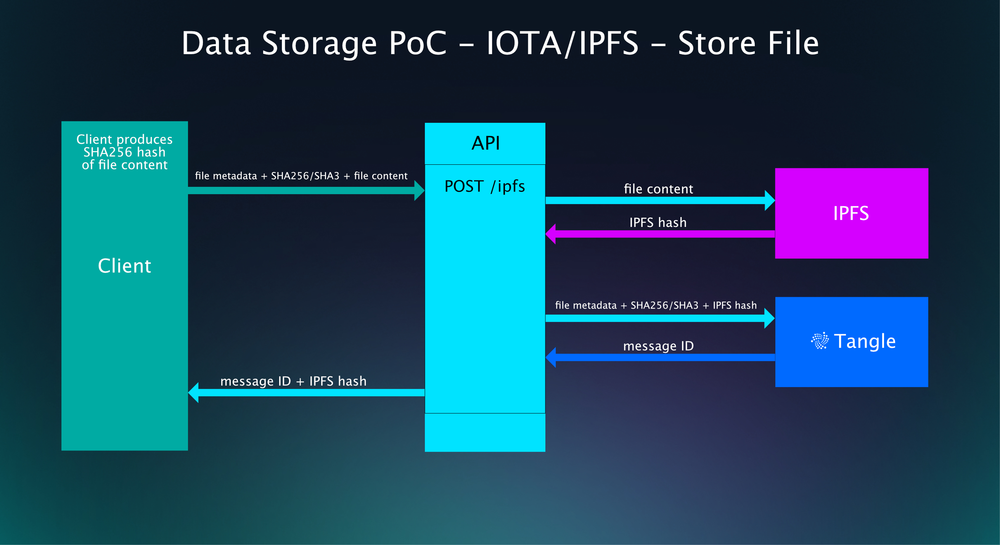

# Application Architecture

**The Tangle data storage application consists of two parts: A graphical user interface (GUI) written in React and a back-end API written in NodeJS.**

:::warning:Disclaimer
Running an open source project, like any human endeavor, involves uncertainty and trade-offs. We hope the architecture described below helps you to deploy similar systems, but it may include mistakes, and can’t address every situation. If you have any questions about your project, we encourage you to do your own research, seek out experts, and discuss them with the IOTA community.
:::

This blueprint uses the following architecture whereby clients upload files to the API server, which sends the files to an InterPlanetary File System (IPFS) node and attaches the IPFS hashes to messages in the Tangle.


## Building Blocks

The API server exposes two methods to the client:

- `storeFile()`
- `retrieveFile()`
  
## storeFile()

To store a file using the API, the client does the following:

- Select the file to upload
- Generate SHA256 or SHA3 hash of the file content
- Capture additional file metadata

Behind the scenes, the API does the following:

- Upload the file content to IPFS, which returns the IPFS hash
- Attach the file metadata, SHA256/SHA3 hash, and IPFS hash to the Tangle in a message, and return the message id to the client



### Uploading File Content to the IPFS

The `storeFile()` method takes a JSON object in the following format:

```javascript
IPFSStoreRequest {
    /**
     * The name of the file to store.
     */
    name: string;

    /**
     * The description of the file to store.
     */
    description: string;

    /**
     * The size of the file to store.
     */
    size: number;

    /**
     * The modified date of the file to store.
     */
    modified: string;

    /**
     * The hash algorithm of the file to store.
     */
    algorithm: string;

    /**
     * The hash of the file to store.
     */
    hash: string;

    /**
     * The data of the file to store in base64.
     */
    data: string;
}
```

On receipt of the JSON object, the file data is uploaded to the IPFS node.

```javascript
import ipfsClient from "ipfs-http-client";

const buffer = Buffer.from(request.data, "base64");
const ipfs = ipfsClient(config.ipfs);
const addResponse = await ipfs.add(buffer);
```

### Attaching the File Data to the Tangle

The `add()` method returns the IPFS hash, which is combined with the other data in the JSON object before being attached to the Tangle in a message.

```javascript
// Create a new client instance
const client = new ClientBuilder().node(config.node.provider).build();

// Get available addresses from a generated random seed
const addresses = client.getAddresses(currentState.seed);

// Get receiving address
const address = await addresses
   .accountIndex(0)
   .range(currentState.addressIndex, currentState.addressIndex + 1)
   .get();

const hashedAddress = Blake2b.sum256(Converter.utf8ToBytes(address[0].toString()));

// Define the payload to add to the message
const tanglePayload = {
   name: request.name,
   description: request.description,
   size: request.size,
   modified: request.modified,
   algorithm: request.algorithm,
   hash: request.hash,
   ipfs: ipfsHash
};

// Send the message to the Tangle
const message = await client
   .message()
   .index(Converter.bytesToHex(hashedAddress))
   .seed(currentState.seed)
   .accountIndex(0)
   .data(new TextEncoder().encode(JSON.stringify(tanglePayload)))
   .submit();
```

The Object returned from `message` contains the message id and the ipfs hash, which is returned to the client to use for reading the data in the Tangle.

## retrieveFile()

To retrieve a file and validate its contents, the client does the following:

- Get the file data from the Tangle, using the message ID
- Get the file contents from IPFS using the returned IPFS hash
- Perform a SHA256/SHA3 hash on the file data, and compare the calculated SHA256/SHA3 with the one returned from the Tangle


### Getting the File Data From the Tangle

To get the file data from the Tangle, we request the message from the IOTA node, using the message ID.

```javascript
// Create a new instance of MessageCacheService
const messageCacheService = new MessageCacheService(config.dynamoDbConnection, config.node.provider);

// Get the message with the given id
const message = await messageCacheService.get(request.messageId);

// Convert message object to payload
const payload = await IotaC2Helper.messageToPayload(message);
```

### Getting the file data from the IPFS

The message ID is used to request the file from the IPFS node, using a public IPFS gateway such as [Cloudflare](https://cloudflare-ipfs.com/ipfs/).

### Comparing the Data

Assuming the file was returned from the IPFS into a buffer, the file is hashed using a SHA256/SHA3 algorithm and the resulting hash is compared to the one from the message.

```javascript
let hex;

if (request.algorithm === "sha256") {
    const hashAlgo = crypto.createHash(request.algorithm);
    hashAlgo.update(buffer);
    hex = hashAlgo.digest("hex");
} else if (request.algorithm === "sha3") {
    const hashAlgo = new SHA3(256);
    hashAlgo.update(buffer);
    hex = hashAlgo.digest("hex");
}

if (hex !== request.hash) {
   throw new Error(
       `The hash for the file is incorrect '${request.hash}' was sent but it has been calculated as '${hex}'`);
}
```

## Customization Considerations

If you want to use this blueprint in your own system, you should consider the following.

### Data Security

Because the IPFS is a distributed web, anyone who has the IPFS hash can download and read the contents of the file. 

To prevent unauthorized entities from reading the data, you could encrypt it before uploading it to the IPFS node.

### Alternative Data Storage Solutions

In this application, data is uploaded to an IPFS node, however the same principles apply if you were to upload to an alternative data storage solution.

To use alternative storage solutions such as Amazon S3 or Azure Storage, you just need to upload the data to it with a unique hash (for example the SHA256/SHA3 hash of the file).
